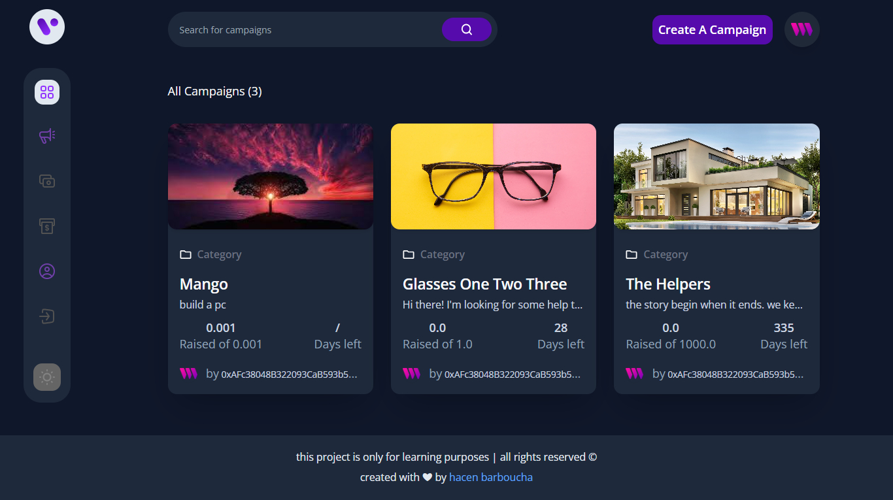
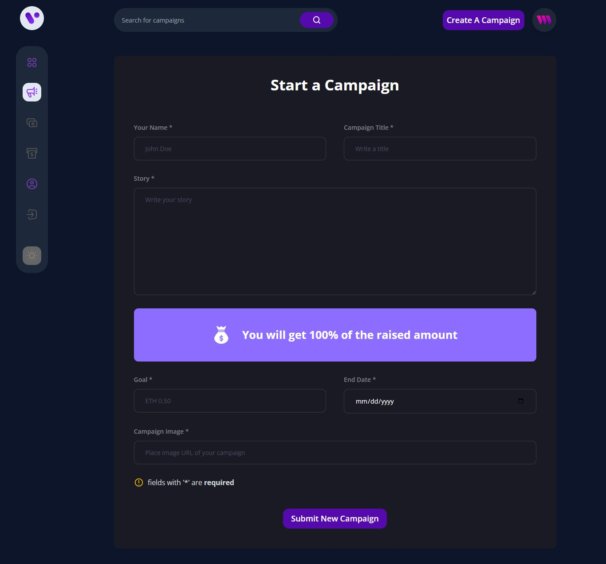

# Crowdfunding platform

`Join the decentralized revolution with our web3 crowdfunding platform. Invest in innovative projects, securely and transparently, using cryptocurrency.`

‼ this project is only for learning purposes

## `What is Web3 ?`

Web3 refers to the next generation of the internet, where users have more control over their data and interactions with decentralized systems, rather than relying on centralized intermediaries. In a web3 context, crowdfunding allows for secure and transparent investment opportunities without the need for a middleman, enabling a more equitable and efficient system for both investors and project creators.

## `Why we use blockchain in crowdfunding ?`

* `Decentralization:` Blockchain eliminates the need for intermediaries and creates a decentralized platform for transactions, making the process more secure, transparent, and efficient.

* `Immutable Record-Keeping:` Transactions made on the blockchain are permanent and can't be altered, providing a tamper-proof record of all investments and funding.

* `Faster Payments:` Blockchain technology enables faster, peer-to-peer transactions without the need for intermediaries, reducing wait times for funding disbursements.

* `Tokenization:` The ability to issue unique tokens for each project on the blockchain allows for easy tracking of investment and distribution of rewards.

* `Security:` Blockchain's cryptographic security measures protect against hacking, fraud, and other malicious activities.

### `Features` 
  
  ✅ Safe and Secure

  ✅ Transparent Transaction

  ✅ payment with Ethereum

  ✅ Industry-ready application

  ✅ Modern / Responsive / Beautiful  Design

### `Used Technologies`

* React.js
* ThirdWeb
* Smart Contract
* Ethers.js
* MetaMask
* TailwindCss
* Vite

### `Learn More`

To learn more take a look at the following resources:

- [React documentation](https://reactjs.org/) - learn React.
- [thirdweb React Documentation](https://docs.thirdweb.com/react) - learn about thirdweb React SDK.
- [Ethers.js Documentation](https://docs.ethers.org/v5/) - learn Ethers.
- [TailwindCSS Documentation](https://tailwindcss.com/) - learn TailwindCSS.
- [Vite Documentation](https://vitejs.dev/guide/) - learn about Vite features.

this project is made with ♥ by <a href="https://github.com/hacenbarb" target="_blank" style="color:light-blue;text-decoration:none">@hacenbarb</a>
